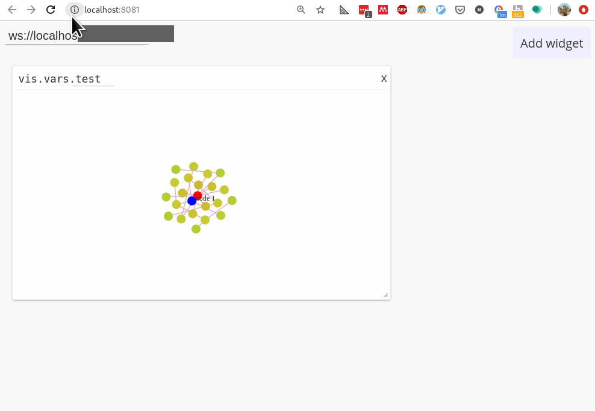

<div align="center">
    
</div>

This is a graph [libvis](http://libvis.dev) module.


---



# Installation

```
libvis-mods download gh:libvis/graph
cd graph
libvis-mods install
```

# Usage 

```python
from libvis import Vis
from libvis.modules import Graph

vis = Vis()
vis.start()

vis.vars.test = Graph.test_object()
```

The state of `vis.vars.test` will be visualised live at `localhost:7000/`. 
